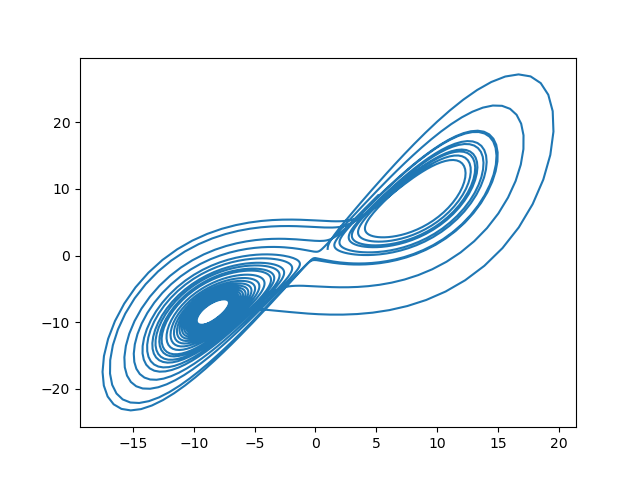
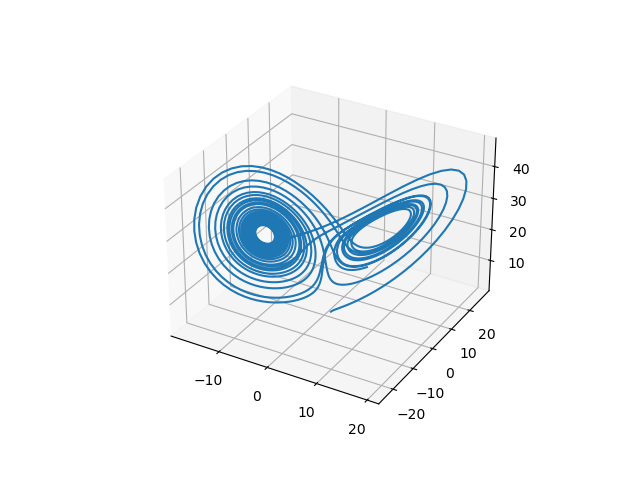

# Lorenz Attractor
A short notebook for solving the [Lorenz System](https://en.wikipedia.org/wiki/Lorenz_system) of differential equations:
    dx/dt = σ(y - x)
    dy/dt = ρx - y - xz
    dz/dt = xy - βz
and making plots of a stream-line.

## How to use
Just hit run! If youd like you can change the constants from the default values of σ=10, ρ=28, and β=8/3, and also the initial values of x, y, z.

## Images
### Projected onto the x-y plane.

### In 3-Dimensions

